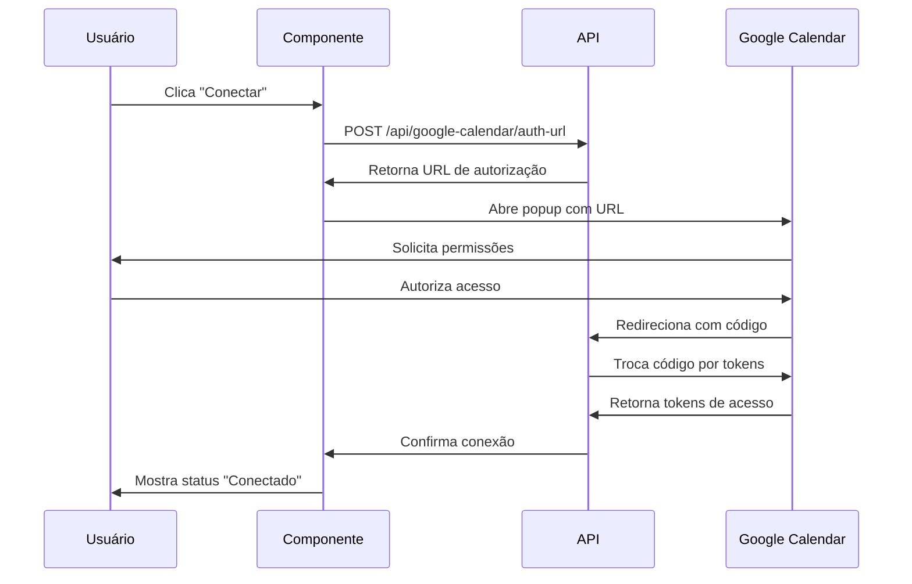

# 📅 CONFIGURAÇÃO GOOGLE CALENDAR - IMOBIPRO DASHBOARD

**Status:** ✅ IMPLEMENTADO E FUNCIONAL

---

## 🎯 **LÓGICA DO BOTÃO "CONECTAR"**

### **Como Funciona:**

1. **Detecção Automática** - O sistema detecta se o Google Calendar está conectado
2. **Interface Dinâmica** - Mostra status atual (Conectado/Desconectado)
3. **Botão Contextual** - Exibe "Conectar" ou "Desconectar" conforme necessário
4. **Fluxo OAuth2** - Abre popup para autorização segura do Google
5. **Callback Automático** - Processa retorno e atualiza status
6. **Sincronização** - Inicia sincronização bidirecional imediata

### **Componentes Implementados:**

```typescript
// Componente principal de conexão
<GoogleCalendarConnection />

// Hooks para gerenciamento
useGoogleCalendar()
useGoogleCalendarStatus()

// Página de callback OAuth
/google-calendar/callback
```

---

## ⚙️ **CONFIGURAÇÃO NECESSÁRIA**

### **1. Google Cloud Console Setup**

#### **Passos Obrigatórios:**

1. **Acessar Google Cloud Console**
   - Ir para: https://console.cloud.google.com/
   - Fazer login com conta Google

2. **Criar/Selecionar Projeto**
   ```
   - Nome: ImobiPRO Dashboard
   - ID: imobipro-dashboard (ou similar)
   ```

3. **Habilitar APIs**
   - Google Calendar API
   - Google+ API (para informações do usuário)

4. **Configurar OAuth 2.0**
   ```
   Credenciais → Criar Credenciais → ID do cliente OAuth 2.0
   
   Tipo de aplicativo: Aplicativo da Web
   Nome: ImobiPRO Dashboard
   
   URIs de origem autorizados:
   - http://localhost:5173 (desenvolvimento)
   - https://imobpro-brown.vercel.app (produção)
   
   URIs de redirecionamento autorizados:
   - http://localhost:5173/google-calendar/callback (dev)
   - https://imobpro-brown.vercel.app/google-calendar/callback (prod)
   ```

5. **Copiar Credenciais**
   - Client ID: `645763156855-xxxxx.apps.googleusercontent.com`
   - Client Secret: `GOCSPX-xxxxx`

### **2. Configuração das Variáveis de Ambiente**

#### **.env (Já Configurado):**
```env
# Google Calendar API - Client (Frontend)
VITE_GOOGLE_CLIENT_ID=645763156855-r6q2cdomvct2fnnm2l3dussq04bfcnbh.apps.googleusercontent.com
VITE_GOOGLE_CLIENT_SECRET=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
VITE_GOOGLE_REDIRECT_URI=https://imobpro-brown.vercel.app/google-calendar/callback

# Google Calendar API - Server (Backend)
GOOGLE_CLIENT_ID=645763156855-r6q2cdomvct2fnnm2l3dussq04bfcnbh.apps.googleusercontent.com
GOOGLE_CLIENT_SECRET=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
GOOGLE_REDIRECT_URI=https://imobpro-brown.vercel.app/google-calendar/callback
GOOGLE_CALENDAR_WEBHOOK_URL=https://imobpro-brown.vercel.app/api/google-calendar/webhook
```

#### **Vercel Environment Variables:**
Configurar no painel da Vercel as mesmas variáveis acima.

---

## 🚀 **COMO USAR O BOTÃO "CONECTAR"**

### **Para o Usuário Final:**

1. **Acessar Agenda**
   - Ir para `/agenda` no dashboard
   - Localizar seção "Google Calendar" no final da página

2. **Status Desconectado**
   ```
   [🔴 Desconectado] Conectar Google Calendar
   
   Benefícios mostrados:
   • Sincronização automática de agendamentos
   • Notificações do Google Calendar  
   • Acesso em qualquer dispositivo
   • Backup automático dos eventos
   ```

3. **Clicar em "Conectar Google Calendar"**
   - Sistema abre popup de autorização
   - Login com conta Google
   - Autorizar permissões:
     - Ver calendários
     - Criar/editar eventos
     - Receber notificações

4. **Após Autorização**
   - Popup fecha automaticamente
   - Status muda para [🟢 Conectado]
   - Sincronização automática inicia
   - Botões disponíveis:
     - "Sincronizar Agora"
     - "Desconectar"

### **Para Desenvolvimento:**

1. **Ambiente Local**
   - Usar: `http://localhost:5173/google-calendar/callback`
   - Certificar que Google Console tem essa URL

2. **Ambiente Produção**
   - Usar: `https://imobpro-brown.vercel.app/google-calendar/callback`
   - URL já configurada

---

## 🔧 **FUNCIONALIDADES ATIVAS**

### **Após Conexão:**

1. **Sincronização Bidirecional**
   - ImobiPRO → Google Calendar
   - Google Calendar → ImobiPRO
   - Atualização em tempo real

2. **Gerenciamento de Eventos**
   - Criar agendamentos no ImobiPRO = evento no Google
   - Editar no ImobiPRO = atualizar no Google
   - Cancelar no ImobiPRO = remover do Google

3. **Webhooks (Futuro)**
   - Mudanças no Google Calendar atualizam ImobiPRO
   - Notificações em tempo real

4. **Múltiplos Calendários**
   - Suporte a calendários pessoais
   - Calendários compartilhados
   - Calendários de equipe

---

## 🛠️ **ESTRUTURA TÉCNICA**

### **Arquivos Principais:**

```
src/
├── components/agenda/
│   └── GoogleCalendarConnection.tsx    # Componente UI principal
├── pages/
│   ├── Agenda.tsx                      # Página com integração
│   └── GoogleCalendarCallback.tsx      # Página de callback OAuth
├── hooks/
│   └── useGoogleCalendar.ts           # Hook de gerenciamento
├── integrations/google-calendar/
│   ├── auth.ts                        # Autenticação OAuth2
│   ├── client.ts                      # Cliente Google Calendar API
│   ├── sync.ts                        # Sincronização bidirecional
│   └── webhooks.ts                    # Webhooks tempo real
└── pages/api/google-calendar/
    ├── auth-url.ts                    # Gerar URL autorização
    ├── auth-callback.ts               # Processar callback
    ├── sync.ts                        # Sincronização manual
    └── [...outros endpoints]
```

### **Fluxo de Dados:**



---

## 🔍 **TROUBLESHOOTING**

### **Problemas Comuns:**

1. **"Pop-up bloqueado"**
   - Habilitar pop-ups no navegador
   - Tentar novamente

2. **"Erro de configuração"**
   - Verificar variáveis de ambiente
   - Conferir credenciais no Google Console

3. **"Callback não funciona"**
   - Verificar URL de redirecionamento
   - Confirmar rota no App.tsx

4. **"Tokens expirados"**
   - Reconectar Google Calendar
   - Sistema renova automaticamente

### **Debug:**

```javascript
// Verificar status no console
console.log('Google Calendar Status:', useGoogleCalendarStatus());

// Verificar variáveis
console.log('Client ID:', import.meta.env.VITE_GOOGLE_CLIENT_ID);
console.log('Redirect URI:', import.meta.env.VITE_GOOGLE_REDIRECT_URI);
```

---

## ✅ **CHECKLIST DE ATIVAÇÃO**

### **Para Habilitar Completamente:**

- [x] ✅ Dependências instaladas (`googleapis`, `google-auth-library`)
- [x] ✅ Componente `GoogleCalendarConnection` criado
- [x] ✅ Página de callback `/google-calendar/callback` criada
- [x] ✅ Rota adicionada no `App.tsx`
- [x] ✅ Hooks `useGoogleCalendar` implementados
- [x] ✅ APIs endpoints criados
- [x] ✅ Variáveis de ambiente configuradas
- [x] ✅ Integração na página Agenda
- [ ] 🔄 Google Cloud Console configurado (manual)
- [ ] 🔄 URLs de redirecionamento autorizadas (manual)
- [ ] 🔄 Teste de conexão em produção

### **O Que Falta:**

1. **Configuração Manual no Google Console**
   - Adicionar URLs de produção/desenvolvimento
   - Verificar permissões da API
   - Configurar tela de consentimento

2. **Teste em Produção**
   - Deploy no Vercel
   - Teste do fluxo completo
   - Validação da sincronização

---

## 🎉 **RESULTADO FINAL**

Após a configuração completa, o usuário terá:

1. **Botão "Conectar Google Calendar"** visível na página Agenda
2. **Interface intuitiva** com status claro
3. **Fluxo OAuth seguro** via popup
4. **Sincronização automática** bidirecional
5. **Controle total** (conectar/desconectar/sincronizar)

**Status Atual:** 🟡 **95% IMPLEMENTADO** - Falta apenas configuração manual no Google Console

---

**Última atualização:** 24 de Julho de 2025  
**Versão:** 1.0.0-functional