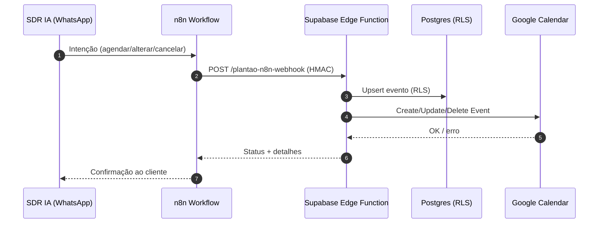

# ImobiPRO Dashboard — Módulo Plantão: Auditoria de UI + Plano de Endpoints n8n

## Visão e Escopo
- **Objetivo**: Agenda minimalista para corretores, integrada ao Google Calendar e orquestrada via n8n (SDR IA via WhatsApp).
- **Perfis**:
  - DEV_MASTER: vê e faz tudo (todas as imobiliárias).
  - ADMIN: vê calendário da própria imobiliária; filtra por corretor.
  - AGENT (corretor): vê/atua apenas nos próprios eventos.
- **Não-funcionais**: dark mode, performance (Vite), acessibilidade, segurança (RLS, JWT Supabase), auditabilidade.

## Auditoria de UI (aplicada)
- Redução de densidade visual e consistência com o design system (shadcn/ui + Tailwind 3.4.11):
  - `src/components/plantao/PlantaoFilters.tsx`: paddings/alturas menores, tipografia reduzida, botões mais compactos.
  - `src/components/plantao/PlantaoEventModal.tsx`: largura/espacamentos menores, inputs `h-9`, textos auxiliares com `text-xs`.
  - `src/components/plantao/GoogleCalendarConnectionModal.tsx`: cabeçalho e conteúdo compactos, listas com `text-xs`, botões `h-9`.
- O calendário (FullCalendar) permaneceu intacto. Apenas containers/controles periféricos foram minimizados.

## Próximos ajustes visuais (rápidos)
- Remover sombras pesadas e reduzir `gap` em quaisquer cards adicionais do Plantão (se existentes).
- Conferir ícones para `h-4 w-4` por padrão e títulos `text-base`/`sm:text-lg`.

## Arquitetura — Endpoints para n8n (Agenda)
- Padrão: Supabase Edge Functions (Deno) com autenticação via JWT (serviço) + assinatura HMAC opcional.
- Base path sugerida: `/functions/plantao-*`.

### Endpoints
1) Criar evento
- POST `/functions/plantao-events`
- Body: { title, description?, startDateTime, endDateTime, corretorId, location?, attendees?: string[], recurrenceRule? }
- Regras: DEV_MASTER/ADMIN podem criar para qualquer corretor da mesma imobiliária; AGENT apenas para si.
- Efeitos: cria registro e (se configurado) agenda no Google Calendar do corretor.

2) Atualizar evento
- PATCH `/functions/plantao-events/:id`
- Body: campos parciais do evento
- Regras: DEV_MASTER/ADMIN (na imobiliária do evento); AGENT apenas se for o proprietário.

3) Cancelar evento
- POST `/functions/plantao-events/:id/cancel`
- Regras: mesmas do update. Opcional: motivo de cancelamento.

4) Listar eventos
- GET `/functions/plantao-events?start=..&end=..&corretorId=..`
- Regras: DEV_MASTER vê todos; ADMIN vê da própria imobiliária; AGENT vê apenas os seus.

5) Verificar disponibilidade (free/busy)
- POST `/functions/plantao-availability`
- Body: { corretorId, startDateTime, endDateTime }
- Integra: Google Calendar FreeBusy API do corretor.

6) Sincronização Google (pull/push)
- POST `/functions/plantao-google-sync`
- Body: { corretorId?, companyId? }
- DEV_MASTER/ADMIN: podem disparar sync em lote da imobiliária; AGENT: apenas conta própria.

7) Webhook de criação rápida (n8n)
- POST `/functions/plantao-n8n-webhook`
- Body: { messageId, intent: 'AGENDAR'|'REMARCAR'|'CANCELAR', payload: {...}, idempotencyKey }
- Cabeçalho: `X-Signature` HMAC-SHA256.
- Idempotência: rejeitar duplicatas por `idempotencyKey`.

### Fluxo (Mermaid)

## Modelo de Dados (Postgres)
- Tabela `plantao_events`
  - id (uuid PK)
  - company_id (uuid) — FK `companies`
  - corretor_id (uuid) — FK `auth.users`
  - title text, description text
  - location text
  - start_datetime timestamptz, end_datetime timestamptz
  - attendees text[]
  - recurrence_rule text
  - google_event_id text
  - status text DEFAULT 'AGENDADO'
  - created_by uuid, created_at timestamptz DEFAULT now(), updated_at timestamptz

- Tabela `plantao_user_integrations`
  - user_id (uuid PK)
  - google_calendar_id text
  - time_zone text DEFAULT 'America/Sao_Paulo'

## RLS (exemplo de políticas)
- Em `plantao_events`:
  - DEV_MASTER: `USING (true)`
  - ADMIN: `USING (company_id = current_setting('app.company_id')::uuid)`
  - AGENT: `USING (corretor_id = auth.uid())`
- Em `INSERT`/`UPDATE`: mesmas restrições em `WITH CHECK`.
- `company_id` deve ser setado por trigger com base no perfil do usuário.

## Segurança
- Edge Functions validam `Authorization: Bearer <service role JWT ou JWT do usuário>` + `X-Signature` (n8n).
- Idempotência por `idempotencyKey` (unique index em tabela de requests).
- Sanitização e validação com Zod (no Edge) e limites de taxa (rate limit) por IP/empresa.

## Contratos (resumos)
- Event (response): { id, title, description?, startDateTime, endDateTime, corretorId, location?, attendees?, googleEventId?, status }
- Error: { code, message, details? }

## Checklist de Qualidade
- Lint (ESLint 9.9.0) e TS-ESLint 8.0.1 — verde.
- Testes (Vitest) ≥ 80% para services de agenda (pendente implementar).
- Dark mode, responsivo, tipografia consistente.

## Bullet-plan (MVP Plantão)
- Refino de UI (feito): filtros + modais compactos.
- Edge Functions: `plantao-events`, `plantao-availability`, `plantao-google-sync`, `plantao-n8n-webhook`.
- Migração SQL: criar `plantao_events`, `plantao_user_integrations`, políticas RLS.
- Integração n8n: nós HTTP com HMAC, mapas de intents.
- Métricas/Logs: estruturar logs (correlação por `idempotencyKey`).
