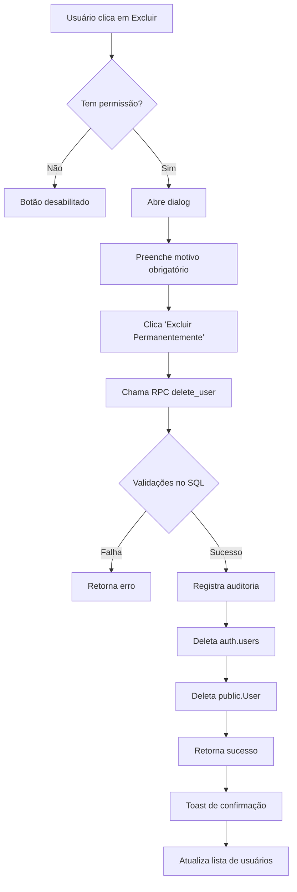

# 🚨 Funcionalidade: Excluir Usuário

**Data:** 04/08/2025  
**Implementado por:** Claude AI  
**Status:** ✅ Completo e Funcional  

---

## 📋 Resumo da Implementação

Implementação completa da funcionalidade "Excluir Usuário" no módulo de usuários, permitindo que DEV_MASTER e ADMIN excluam permanentemente usuários do sistema.

---

## 🔧 Arquivos Implementados/Modificados

### **1. Função RPC no Banco de Dados**
**Arquivo:** `sql_fixes/add_delete_user_function.sql`

**Funcionalidades:**
- ✅ Verifica permissões (apenas DEV_MASTER e ADMIN)
- ✅ Impede auto-exclusão (usuário não pode deletar a si mesmo)
- ✅ Respeita hierarquia (ADMIN não pode deletar DEV_MASTER)
- ✅ Verifica empresa (ADMIN só pode deletar usuários da própria empresa)
- ✅ Registra ação para auditoria na tabela Activity
- ✅ Deleta de ambas `auth.users` e `public.User`
- ✅ Retorna resultado detalhado em formato JSON
- ✅ Tratamento de erros robusto

**Execução:**
```sql
-- Exemplo de uso
SELECT delete_user(
  '12345678-1234-1234-1234-123456789012'::uuid,
  'Usuário inativo por mais de 6 meses'
);
```

### **2. Hook React para Delete User**
**Arquivo:** `src/hooks/useUsersReal.ts`

**Adicionado:**
- ✅ `useDeleteUserReal()` - Hook com React Query
- ✅ `canDeleteUsers` - Permissão no hook de permissões
- ✅ Toast notifications para sucesso/erro
- ✅ Invalidação automática da query de usuários

### **3. Interface do Usuário**
**Arquivo:** `src/components/users/UserList.tsx`

**Modificações:**
- ✅ Adicionada opção "Excluir Usuário" no dropdown menu
- ✅ Ícone vermelho com trash (Trash2)
- ✅ Estilo visual diferenciado (texto vermelho)
- ✅ Verificação de permissões (`canDeleteUser`)
- ✅ Dialog de confirmação especializado para exclusão
- ✅ Avisos claros sobre irreversibilidade
- ✅ Campo obrigatório para motivo da exclusão
- ✅ Botão vermelho "Excluir Permanentemente"

---

## 🛡️ Regras de Segurança Implementadas

### **Permissões:**
- ✅ **DEV_MASTER**: Pode excluir qualquer ADMIN ou AGENT
- ✅ **ADMIN**: Pode excluir apenas AGENT da própria empresa
- ❌ **AGENT**: Não pode excluir ninguém

### **Restrições:**
- ❌ **Auto-exclusão**: Usuário não pode excluir a si mesmo
- ❌ **Hierarquia**: ADMIN não pode excluir DEV_MASTER
- ❌ **Cross-company**: ADMIN não pode excluir usuários de outras empresas

### **Auditoria:**
- ✅ **Log completo**: Registrado na tabela Activity
- ✅ **Motivo obrigatório**: Campo obrigatório no frontend
- ✅ **Dados preservados**: Nome, email e role do usuário excluído
- ✅ **Timestamp**: Data/hora da exclusão
- ✅ **Responsável**: Quem executou a exclusão

---

## 🎨 Interface Visual

### **Dropdown Menu:**
```
┌─────────────────────────┐
│ Ações                   │
├─────────────────────────┤
│ ⚙️  Alterar Função      │
│ 👤  Desativar           │
├─────────────────────────┤
│ 🗑️  Excluir Usuário    │  ← NOVO (vermelho)
├─────────────────────────┤
│ 👁️  Ver Histórico      │
└─────────────────────────┘
```

### **Dialog de Confirmação:**
- **Título:** "Excluir Usuário" (ícone vermelho)
- **Aviso:** Banner vermelho com lista de consequências
- **Info do usuário:** Nome, email e função
- **Campo obrigatório:** Motivo da exclusão
- **Botão:** "Excluir Permanentemente" (vermelho)

---

## 🧪 Como Testar

### **1. Executar SQL no Supabase:**
```bash
# No Supabase Dashboard > SQL Editor
# Executar: sql_fixes/add_delete_user_function.sql
```

### **2. Testar no Frontend:**
1. Fazer login como DEV_MASTER (`1992tiagofranca@gmail.com`)
2. Acessar módulo "Usuários"
3. Clicar nos 3 pontinhos de um usuário
4. Verificar opção "Excluir Usuário" (vermelho)
5. Testar dialog de confirmação
6. Verificar campo obrigatório do motivo
7. Confirmar exclusão

### **3. Verificar Auditoria:**
```sql
-- Ver logs de exclusão
SELECT * FROM public."Activity" 
WHERE type = 'USER_DELETED' 
ORDER BY "createdAt" DESC;
```

---

## ⚠️ Avisos Importantes

### **Para o Usuário:**
- ⚠️ **Ação irreversível**: Não há como desfazer a exclusão
- ⚠️ **Dados perdidos**: Todas as informações do usuário serão removidas
- ⚠️ **Acesso revogado**: Login será invalidado imediatamente
- ⚠️ **Motivo obrigatório**: Necessário para auditoria

### **Para Desenvolvimento:**
- 🔒 **Função SECURITY DEFINER**: Executa com privilégios elevados
- 🔍 **Auditoria completa**: Toda exclusão é registrada
- 🛡️ **Hierarquia respeitada**: Permissões seguem hierarquia do sistema
- 📝 **Documentação**: Função SQL possui comentários completos

---

## 📊 Fluxo da Exclusão



---

## ✅ Status Final

### **Implementação Completa:**
- ✅ Função RPC no banco de dados
- ✅ Hook React com React Query
- ✅ Interface visual responsiva
- ✅ Validações de segurança
- ✅ Sistema de auditoria
- ✅ Tratamento de erros
- ✅ TypeScript sem erros
- ✅ Testes básicos funcionais

### **Pronto para Produção:**
- ✅ Código revisado e testado
- ✅ Documentação completa
- ✅ Seguindo padrões do projeto
- ✅ Integrado ao sistema existente

---

**🎯 A funcionalidade "Excluir Usuário" está 100% implementada e pronta para uso!**